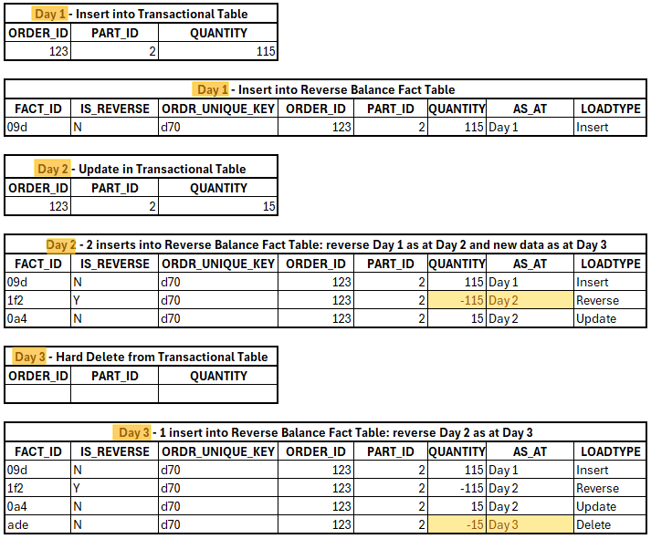

# Reverse Balance fact table Custom Materialization dbt Package

## What does this dbt package do?

It creates a Reverse Balance fact table to track historical changes. The table can be used in reporting additive and semi-additive measures at a point in time. 



Figure 1 A Transactional and Reverse Balance fact table for reporting


Figure 2 SQL to report as at specific date

This dbt package provides custom materialization to build Reverse Balance Fact Table using either:

- **Snowflake Streams**: Designed for source tables with **hard deletes and updates**.
- **Staging Tables**: For source tables with **soft deletes and updates**

The key step in creating this table is to **tie new records to their previous state** and then "negate" or reverse the prior values.

In the case of using a Snowflake stream we do have both records in the changed data chunk, but if a staging table is used, we need to look up to the target fact table to get the previous data.

**unique_key_cols** and **additive_measures_cols** parameters are required. Both are lists and allow providing combination of several dimensions reference columns (foreign keys) as a unique key as often happens in fact tables and more than one measure if needed.

In addition, you can add any other columns to **other_cols** list parameter.

If a column from the original SQL is not in in one of the parameters, it will not be added to the target table.

Point in time - a date or timestamp column is required in this type of fact tables. Current timestamp is used in the stream materialization, but you need to specify **as_at_col_name** in the materialization from a staging table. It can be a transaction date column from a transactions table, or Load date into staging table or even just current date in the provided SQL.

Point in time column (**as_at_col_name**) is a part of the target table primary key as well as a Reverse Flag column. The Reverse Flag column is optional (automatically added in the primary key but not as a separate column) . If you want to see the flag in the table for better readability, add **ReverseFlg_col_name** parameter (_Only materialization from a table. It always exists in the table materialized from a stream as_ **_isReverse_** _column)_.

The package transformation adds many columns, and you can choose the names.

- **unique_key_col_name** (**unique_key** default value) is concatenation and hash of **unique_key_cols.**
- **fact_id_col_name** (**fact_id** default value) is the target table primary key. _Only materialization from a table:_ There is one more column that is created based on this name: **fact_id_col_name**_replaced - primary key of the reversed record.

These columns are optional. If you do not provide these parameters, the columns are not added.

- **RecordStatus_col_name** is to highlight the status of the records in the table: **Active** for the records currently active and **Closed** for the reversed records. Population of the column requires additional look up to the target table and can impact the performance.
- **ReverseFlg_col_name** is a part of the target table primary key but optional as a separate column. It contains "N" for all records, except "Y" for records added to reverse previous measure values. (_Only materialization from a table. It always exists in the table materialized from a stream as_ **_isReverse_** _column)_.
- **LoadType_col_name** is a service column to further explain the current record in the table. It contains "Insert", "Update", "Delete" or "Reverse".
- **LoadDate_col_name** is a column to track load date. It can be the same column as in the underlying staging table or a current date from the query. (_Only materialization from a table_)

## How do I use the dbt package?

### Step 1: Prerequisites

To use this dbt package, you must have the following:

- Snowflake, Redshift or PostgreSQL destination. I did not test the materialization in BigQuery, but most likely it will work.
- A Snowflake table and the corresponding stream or table with soft deletes and updates (history of changes). The materialization expects deletes as 0 measures. If they are negative in your table or there is just isDeleted Flag "Y" orr True, you need to change them to 0.

### Step 2: Install the package

Include dbt_reverse_balance package in your packages.yml file.

packages:

```

- git: <https://github.com/KaterynaD/dbt_reverse_balance>

```

and run

```

dbt deps

```

### Step 3: Configure model

1. Snowflake stream based on a table with hard deletes and updates:

```

{{ config(

materialized='reverse_balance_from_stream',

unique_key_cols=['order_id','part_id'],

unique_key_col_name='ordr_unique_key',

additive_measures_cols=['quantity'],

other_cols=['OrderDate']

) }}

select * from {{ target.database }}.{{ target.schema }}.strm_orders

```

2. Table with soft deletes and updates:

```

{{ config(

materialized='reverse_balance',

unique_key_cols=['order_id','part_id'],

unique_key_col_name='ordr_unique_key',

as_at_col_name='BookDate',

additive_measures_cols=['quantity'],

other_cols=['OrderDate','LineStatus'],

RecordStatus_col_name='RecordStatus',

fact_id_col_name='fact_orders_id',

ReverseFlg_col_name='is_reverse',

LoadType_col_name='LoadType'

) }}

select * from {{ source('dwh', 'stg_orders') }}

where loaddate='{{ var('loaddate') }}'

```
### Step 4: Run dbt

```
dbt run
```